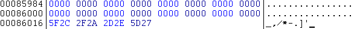



## Advanced High\-Speed Sectional CRC32 Wrapping protection for your Exe of any size

### Description

Calculates a unique CRC32 hash based on strings from important sections of your exe (as opposed to the entire exe, including non-critical things such as images, sound etc).

This means you can protect exe's of virtually ANY size using CRC32. If you choose your sections carefully enough, the protection can be just about as good as if you had protected every byte in the file. Please vote for this if you think it's worthy of one :-)
 
### More Info
 

             |
---                |---
**Submitted On**   |2000-07-01 18:18:14
**By**             |[Detonate](https://github.com/Planet-Source-Code/PSCIndex/blob/master/ByAuthor/detonate.md)
**Level**          |Advanced
**User Rating**    |4.9 (78 globes from 16 users)
**Compatibility**  |VB 3\.0, VB 4\.0 \(16\-bit\), VB 4\.0 \(32\-bit\), VB 5\.0, VB 6\.0, VB Script, ASP \(Active Server Pages\) 
**Category**       |[Files/ File Controls/ Input/ Output](https://github.com/Planet-Source-Code/PSCIndex/blob/master/ByCategory/files-file-controls-input-output__1-3.md)
**World**          |[Visual Basic](https://github.com/Planet-Source-Code/PSCIndex/blob/master/ByWorld/visual-basic.md)
**Archive File**   |[CODE\_UPLOAD7334712000\.zip](https://github.com/Planet-Source-Code/detonate-advanced-high-speed-sectional-crc32-wrapping-protection-for-your-exe-of-any-size__1-9427/archive/master.zip)

